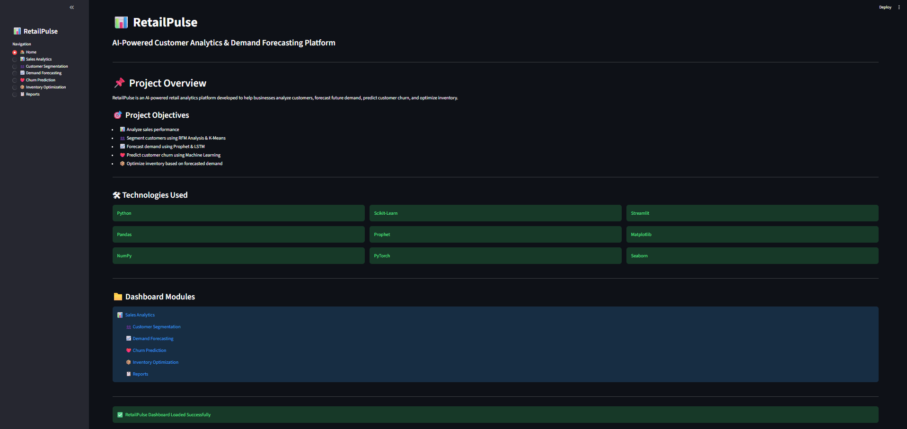
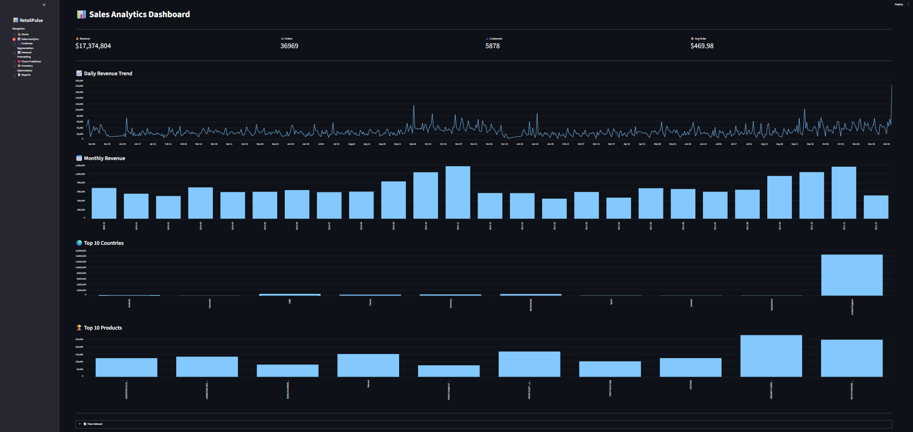
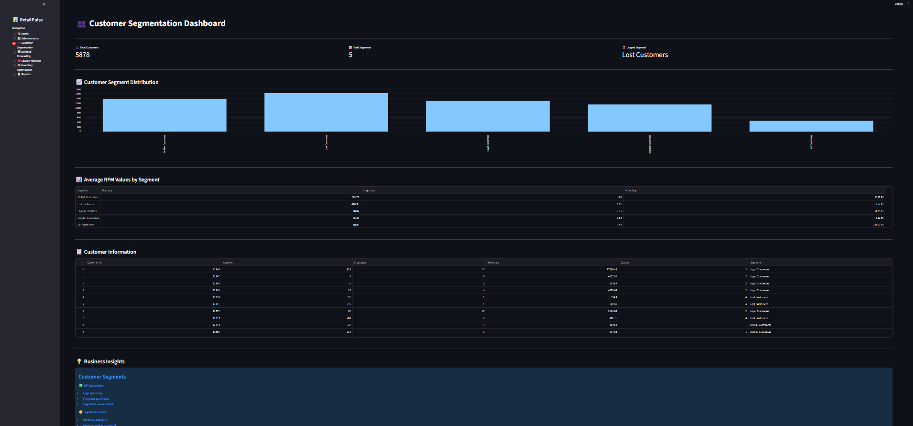
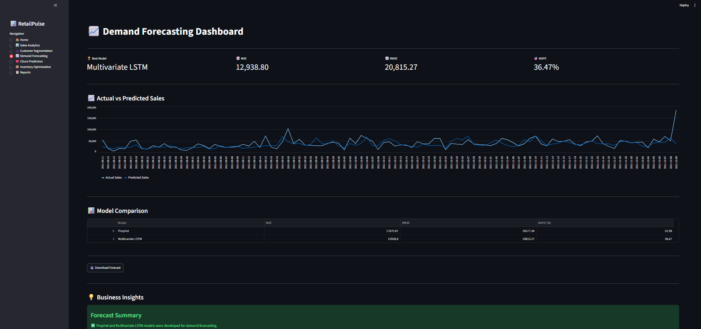
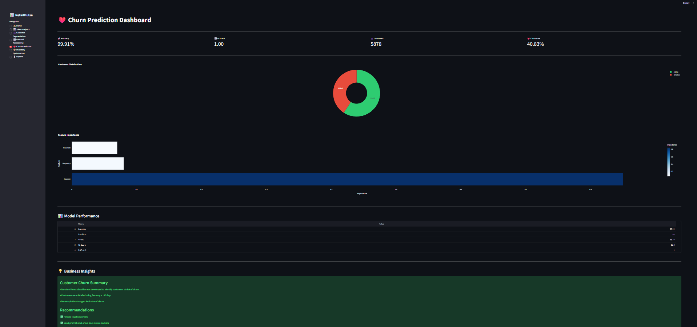
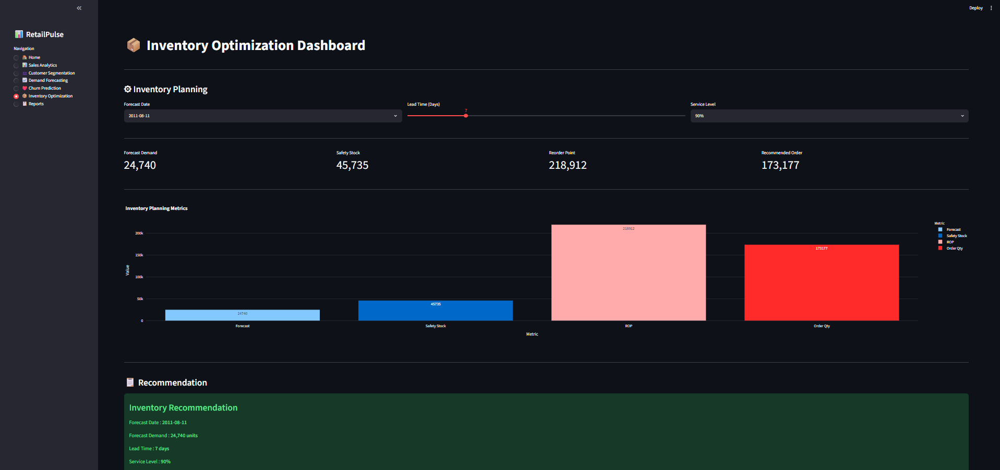

# 📊 RetailPulse: AI-Powered Customer Analytics & Demand Forecasting Platform

> An end-to-end Retail Analytics platform that leverages Machine Learning and Business Intelligence techniques to analyze customer behavior, forecast future sales, predict customer churn, and optimize inventory decisions.

---

## 🚀 Project Overview

RetailPulse is an AI-powered retail analytics platform developed to help businesses make data-driven decisions. The project combines customer segmentation, sales forecasting, churn prediction, and inventory optimization into a single interactive Streamlit dashboard.

The platform enables retailers to better understand customer purchasing behavior, anticipate future demand, identify customers at risk of leaving, and optimize inventory planning to reduce stock shortages and overstock situations.

---

## 🎯 Objectives

- Perform comprehensive Exploratory Data Analysis (EDA)
- Segment customers using RFM Analysis and K-Means Clustering
- Forecast future sales using Prophet and Multivariate LSTM
- Predict customer churn using Machine Learning
- Optimize inventory based on forecasted demand
- Provide an interactive business dashboard using Streamlit

---

# 📂 Dataset

**Dataset:** Online Retail Dataset (UCI Machine Learning Repository)

The dataset contains:

- Customer Transactions
- Invoice Details
- Product Information
- Purchase Dates
- Quantity
- Sales Revenue
- Country Information

---

# ⚙️ Technologies Used

## Programming Language

- Python

## Data Analysis

- Pandas
- NumPy

## Data Visualization

- Matplotlib
- Seaborn
- Plotly

## Machine Learning

- Scikit-learn
- Prophet
- PyTorch (LSTM)

## Dashboard

- Streamlit

---

# 📈 Project Workflow

```
Raw Data
     │
     ▼
Data Cleaning
     │
     ▼
Exploratory Data Analysis
     │
     ▼
Feature Engineering
     │
     ▼
Customer Segmentation
     │
     ▼
Demand Forecasting
     │
     ▼
Churn Prediction
     │
     ▼
Inventory Optimization
     │
     ▼
Interactive Dashboard
```

---

# 📊 Modules

## 1️⃣ Exploratory Data Analysis

- Data Cleaning
- Missing Value Treatment
- Duplicate Removal
- Feature Engineering
- Sales Trend Analysis
- Country-wise Sales
- Product Analysis
- Outlier Detection using Boxplots

---

## 2️⃣ Customer Segmentation

Implemented using:

- RFM Analysis
- K-Means Clustering

Features:

- Recency
- Frequency
- Monetary Value

Generated customer segments such as:

- VIP Customers
- Loyal Customers
- Potential Customers
- At-Risk Customers
- Lost Customers

---

## 3️⃣ Demand Forecasting

Two forecasting models were developed and compared.

### Prophet

Used as the baseline forecasting model.

### Multivariate LSTM

Features Used:

- Sales
- Day of Week
- Month
- Weekend Indicator
- Rolling Mean (7 Days)
- Rolling Standard Deviation (7 Days)

---

### 📌 Model Performance

| Model | MAE | RMSE | MAPE |
|--------|----:|------:|------:|
| Prophet | 17,675.87 | 26,577.34 | 52.99% |
| **Multivariate LSTM** | **12,938.80** | **20,815.27** | **36.47%** |

The Multivariate LSTM model outperformed Prophet across all evaluation metrics and was selected as the final forecasting model.

---

## 4️⃣ Customer Churn Prediction

Model Used:

- Random Forest Classifier

Features:

- Recency
- Frequency
- Monetary Value

Performance:

- Accuracy: **99.91%**
- ROC-AUC: **1.00**

---

## 5️⃣ Inventory Optimization

Inventory planning is performed using the demand forecast generated by the LSTM model.

Metrics Calculated:

- Average Daily Demand
- Safety Stock
- Reorder Point
- Recommended Order Quantity

Interactive Dashboard Features:

- Forecast Date Selection
- Adjustable Lead Time
- Adjustable Service Level
- Dynamic Inventory Recommendations

---

# 📊 Streamlit Dashboard

The interactive dashboard contains:

### 🏠 Home

- Project Overview
- Technologies
- Navigation

### 📊 Sales Analytics

- KPI Cards
- Daily Revenue Trend
- Monthly Revenue
- Top Countries
- Top Products

### 👥 Customer Segmentation

- Segment Distribution
- RFM Summary
- Customer Information
- Business Insights

### 📈 Demand Forecasting

- Actual vs Predicted Sales
- Model Comparison
- Forecast Download
- Performance Metrics

### ❤️ Churn Prediction

- Churn Distribution
- Feature Importance
- Model Performance
- Business Recommendations

### 📦 Inventory Optimization

Interactive inventory planning with:

- Forecast Date Selection
- Lead Time Selection
- Service Level Selection
- Dynamic Safety Stock
- Dynamic Reorder Point
- Recommended Order Quantity

### 📋 Reports

Download:

- Customer Segments
- Forecast Results
- Model Comparison
- Inventory Summary

---


# 📸 Dashboard Screenshots

(Add screenshots after uploading to GitHub)

- Home Dashboard


- Sales Analytics


- Customer Segmentation


- Demand Forecasting


- Churn Prediction


- Inventory Optimization



---

# 💡 Key Business Insights

- Customer segmentation enables personalized marketing strategies.
- LSTM forecasting improves demand prediction compared to Prophet.
- Churn prediction identifies customers requiring retention campaigns.
- Inventory optimization supports efficient stock replenishment.
- The integrated dashboard provides actionable insights for retail decision-making.

---

# 🔬 Experimental Analysis

Outlier analysis was performed on daily sales using boxplots and the IQR method.

An additional experiment was conducted by treating the most extreme sales outliers and retraining the LSTM model.

Results showed that although RMSE decreased slightly, MAE and MAPE increased, indicating that the extreme values represented genuine retail demand rather than erroneous observations. Consequently, the original dataset was retained for final model development.

---

# 🚀 Future Enhancements

- Real-Time Sales Forecasting
- Cloud Deployment
- Live Database Integration
- Customer Recommendation Engine
- Automatic Inventory Alerts
- AI Chat Assistant for Business Insights

---


# 👨‍💻 Author

**Love Kumar Bansal**

B.Tech – Electronics & Communication Engineering

Swami Keshavanand Institute of Technology (SKIT)

Jaipur, Rajasthan

---

# ⭐ If you found this project useful, consider giving it a star!